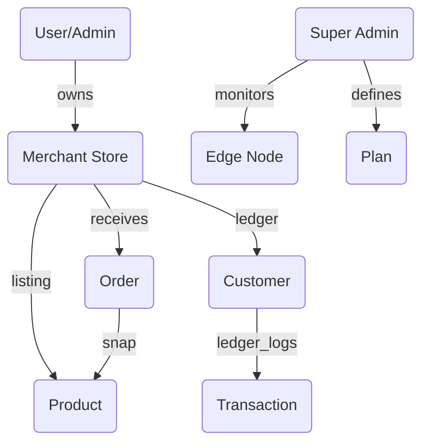

# 🏛️ Mana-Vyapar Full Stack Database Design

This comprehensive database architecture is designed based on a full review of all **Mana-Vyapar** frontend pages (Admin, Merchant Dashboard, and Public-facing Website).

---

## 🚀 Architectural Overview
- **Stack**: MongoDB (NoSQL) with Mongoose ODM.
- **Sharding Strategy**: Designed for regional sharding as per the "Infrastructure" control layer.
- **Security**: AES-256 encryption at rest for sensitive merchant ledgers.

---

## 📁 1. Identity & Access (`users` collection)
Handles authentication for all platform participants.

| Feature Area | Key Fields | Purpose |
| :--- | :--- | :--- |
| **Auth** | `email`, `password`, `refreshToken` | Standard JWT-based secure access. |
| **RBAC** | `role: ["Super Admin", "Merchant", "Support"]` | Controls granular access to dashboards. |
| **Profile** | `fullname`, `avatar` (Cloudinary URL) | Personal identity within the system. |
| **Verification** | `isVerified`, `isActive` | Account status for security clearance. |

---

## 🏢 2. Merchant Store Registry (`merchants` collection)
Extended profile for businesses using the platform.

| Feature Area | Key Fields | Purpose |
| :--- | :--- | :--- |
| **Identity** | `businessName`, `logo`, `ownerId` (Ref: User) | Branding for the mini-website. |
| **Operations** | `operatingHours` (JSON), `storeAddress` | Logistics and visitor information. |
| **Compliance** | `gstNumber`, `businessPhone` | Tax and communication metadata. |
| **Automation** | `whatsappSettings: { botEnabled, autoReply }` | Configures the WhatsApp business bot. |
| **Billing** | `activePlanId` (Ref: Subscription) | Current tier (Starter, Matrix, Enterprise). |

---

## 📦 3. Smart Inventory Hub (`products` collection)
Supports the e-commerce storefront and predictive inventory workflows.

| Feature Area | Key Fields | Purpose |
| :--- | :--- | :--- |
| **Catalog** | `name`, `sku`, `category`, `images` | Public listing data. |
| **Stock** | `stock`, `unit` (kg, pc), `lowStockThreshold` | Powers real-time inventory alerts. |
| **Pricing** | `price`, `costPrice` | Used for calculating Profit/Loss in Analytics. |
| **Vision AI** | `aiTags[]`, `visionConfidence`, `barcode` | Supports the "Vision AI 2.0" scanning feature. |

---

## 📒 4. Digital Khata Ledger (`customers` & `transactions`)
The core financial engine for local credit management.

### 👥 Customers
- `name`, `phone` (Required for WhatsApp reminders).
- `merchantId` (Ref: User).
- `totalBalance` (Cached sum of all transactions for UI speed).

### 💸 Transactions
- `customerId` (Ref: Customer).
- `amount`, `type: ["credit", "debit"]`.
- `description` (e.g., "Grocery credit").
- `billUrl` (S3/Cloudinary link to digitized receipt).

---

## 🚚 5. Order Fulfillment Matrix (`orders` collection)
Manages the lifecycle of an order from website/WhatsApp to delivery.

| Feature Area | Key Fields | Purpose |
| :--- | :--- | :--- |
| **Items** | `products: [{ productId, quantity, price }]` | Snapshot of the purchase. |
| **Total** | `subtotal`, `tax`, `grandTotal` | Monetary record. |
| **Logistics** | `deliveryType: ["Pickup", "Delivery"]`, `address` | Fulfillment route. |
| **Pipeline** | `status: ["pending", "processing", "shipped", "delivered"]` | Real-time queue management. |

---

## 👑 6. Platform Infrastructure (`system` & `subscriptions`)
Global management layer for Super Admins.

### 📡 System Infrastructure (`nodes` collection)
- `nodeId` (e.g., EDGE-INDIA-01).
- `region` (asia-south, us-east, etc.).
- `status` (Healthy, Degraded).
- `load` (Current CPU/RAM usage).

### 💳 Subscription Matrix (`subscriptions` collection)
- `name` (Starter, Matrix, Enterprise).
- `price`, `period`.
- `limits: { maxSKUs, maxStaff, hasAIVision }`.

---

## 🔗 Relationship Mapping

---

## 🛠️ Data Integrity Patterns
- **Aggregation**: Use MongoDB `$group` on the `Orders` collection to provide the `Revenue Velocity` chart seen in Analytics.
- **TTL Indexes**: Useful for "System Kernel Logs" to auto-purge after 30 days.
- **Virtuals**: Calculate `stockStatus` (Healthy vs Critical) on-the-fly based on `lowStockThreshold`.
